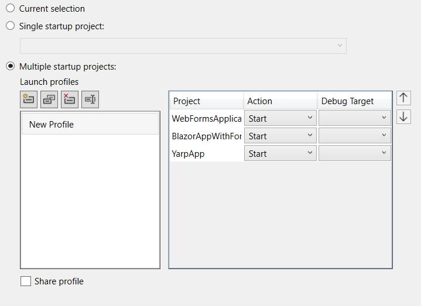

Webforms App With Blazor using YARP as a reverse proxy with shared Forms Authentication between the two apps.

## Prerequisites

-   An existing Webforms database with FormsAuthentication
-   .NET 3.1, 4.7.2, and 9.0 installed

## After clone

-   Configure Solution Properties to run all 3 applications on start



---

-   This is not required but very helpful - Ensure only one of the projects run the browser. This just stops multiple instances of Edge starting when running the program.

## WebForms and FormsAuthentication Config

Authentication is shared via a shared cookie in the temp folder defined in the key SharedKeyFileLocation. This folder is accessed via both apps and must be the same in appsettings.json and Web.config. It is crucial that the information in both configs is the same.

`Web.config`

```
<connectionStrings>
	<add name="ASPNETDB" connectionString="Data Source=(LocalDB)\MSSQLLocalDB;AttachDbFilename=|DataDirectory|\aspnetdb.mdf;Integrated Security=True;" providerName="System.Data.SqlClient" />
</connectionStrings>

<location allowOverride="true" inheritInChildApplications="true">
	<appSettings>
		<clear />
		<add key="SharedKeyFileLocation" value="C:\\Temp\\Web\\Shared\\" />
		<add key="CookieName" value=".SharedCookie" />
		<add key="DomainName" value="localhost" />
		<add key="ApplicationName" value="WebFormsApplication" />
	</appSettings>
</location>
```

`appsettings.json`

```json
{
	"AllowedHosts": "*",
	"SharedKeyFileLocation": "C:\\Temp\\Web\\Shared\\",
	"CookieName": ".SharedCookie",
	"ApplicationName": "WebFormsApplication",
	"DomainName": "localhost"
}
```

## YARP Config

The YARP (Yet Another Reverse Proxy) Config is very simple. It can be found in `appsettings.json` in YarpApp

The clusters define the endpoints YARP will proxy. You can leave them as is. If needed you can change the `Address` field in either blazor or legacy (WebForms) to be the URL that the respected app will run on

```json
"Clusters": {
  "blazor": {
    "Destinations": {
      "blazorApp": {
        "Address": "https://localhost:44338/"
      }
    }
  },
  "legacy": {
    "Destinations": {
      "webFormsApp": {
        "Address": "http://localhost:5268/"
      }
    }
  }
}
```

There are several static assets that are required for blazor to serve the static assets. These should not be modified otherwise functionality or styles will be missing.

Once a page is added in blazor, you need to place it into appsettings.json so that YARP knows that the page is no longer in the legacy system.

For example:

```json
"weather": {
	"Match": { "Path": "/weather" },
	"ClusterId": "blazor"
}
```

This defines a new page called weather that is hosted on the path `/weather`. The `ClusterId` relates to the previously defined `Clusters`. This has to match the name of our cluster, in this case it is blazor.

---

[Credit to this repository + More information](https://github.com/JDGoldman/WebFormsWithBlazor)
